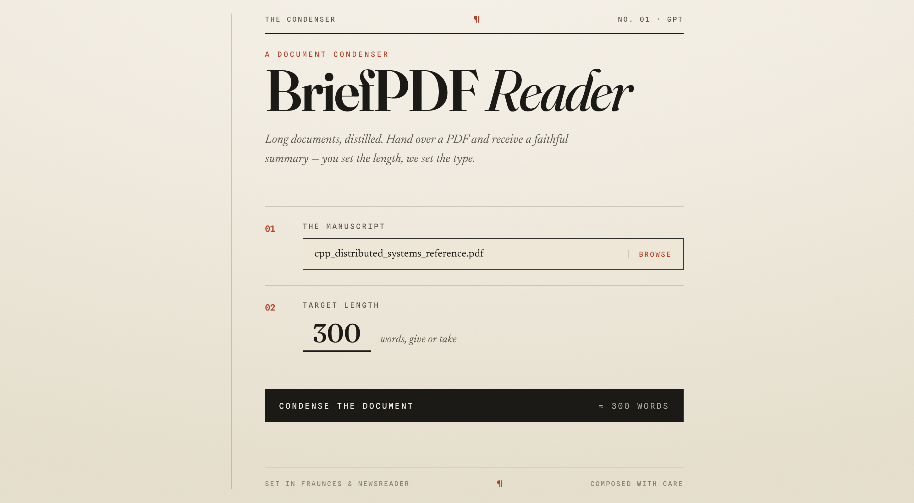
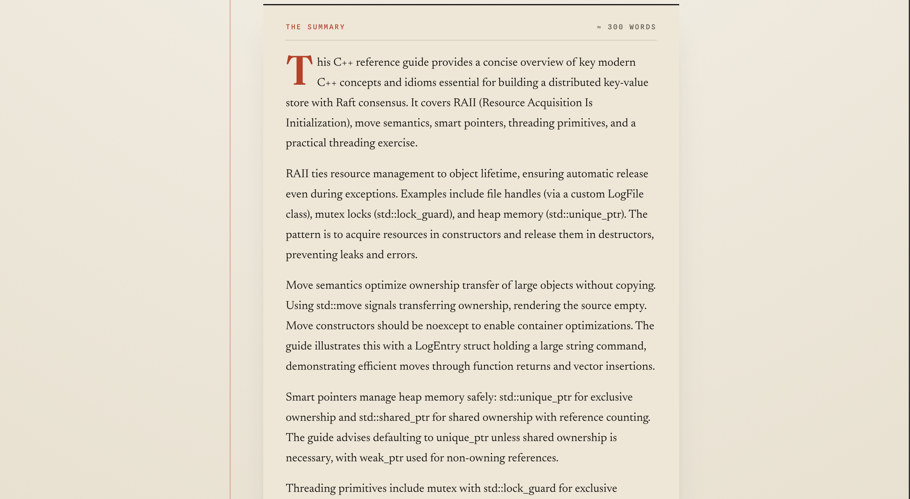

# BriefPDF Reader

Long documents, distilled. Upload a PDF, choose a target length, and get a
faithful, length-controlled summary; rendered as a clean, typeset excerpt.

## 🔗 Try it

**Live app: [brief-pdf-reader.vercel.app](https://brief-pdf-reader.vercel.app/)**

No sign-up required. Drop in a PDF, pick how many words you want (10–2500), and
hit **Condense the document**.

## Screenshots

**Landing** — pick a PDF and a target length, then condense.



**Result** — the summary, rendered as a clean, typeset excerpt.



## What it does

1. You upload a PDF and set a target summary length.
2. The backend extracts the document's text.
3. It asks OpenAI (`gpt-4.1-mini`) to summarize it. Documents that fit in the
   model's context window are summarized in a single call; very large documents
   are chunked, summarized in pieces, and re-summarized until they fit.
4. The summary is returned and rendered as formatted Markdown.

## Features

- **Length control** — request a summary of ~10 to ~2500 words.
- **Markdown output** — headings, lists, and emphasis are rendered, not shown raw.
- **Robust ingestion** — 20 MB upload limit, PDF-only validation, and a clear
  message when text can't be extracted.
- **Hardened API** — per-IP rate limiting, request timeouts with retries,
  sanitized error responses, and CORS.

## Architecture

```text
  Browser ──────────────►  Frontend (React, Vercel)
                                │  POST /api/pdfsummary  (multipart PDF)
                                ▼
                          Backend (Express, Railway)
                            ├── services/pdf.js        extract text
                            ├── services/tokens.js     count + chunk
                            └── services/summarize.js  OpenAI gpt-4.1-mini
```

The OpenAI API key lives only on the backend (Railway) and is never sent to the
browser. The frontend talks to the backend over HTTPS via a build-time
`REACT_APP_API_BASE_URL`.

## Tech stack

- **Frontend** — React (CRA), react-markdown, axios. Deployed on **Vercel**.
- **Backend** — Node, Express, Multer, pdf.js-extract, OpenAI SDK v4. Deployed on **Railway** (Docker).
- **AI** — OpenAI `gpt-4.1-mini`.
- **Tests** — Jest + supertest.

## Run locally

Requires Node 18+ and an OpenAI API key.

**Backend** (from `PDF Summarizer/`)

```bash
cp .env.example .env        # then fill in OPENAI_API_KEY
npm install
npm run dev                 # http://localhost:5000
```

**Frontend** (from `PDF Summarizer/frontend/`)

```bash
npm install
npm start                   # http://localhost:3000 (proxies /api -> :5000)
```

Leave `REACT_APP_API_BASE_URL` empty for local dev, the CRA proxy forwards
`/api` calls to the local backend.

**Tests** (from `PDF Summarizer/`)

```bash
npm test
```

## Project layout

```text
PDF Summarizer/
  backend/
    server.js              bootstrap (load config, listen)
    app.js                 express app + middleware + error handler
    config.js              env loading + validation
    routes/summary.js      POST /api/pdfsummary
    services/              pdf · tokens · summarize
    __tests__/             jest + supertest suite
  frontend/
    src/screens/PDFSummary/   the single-page UI
  Dockerfile               backend container (Railway)
```
